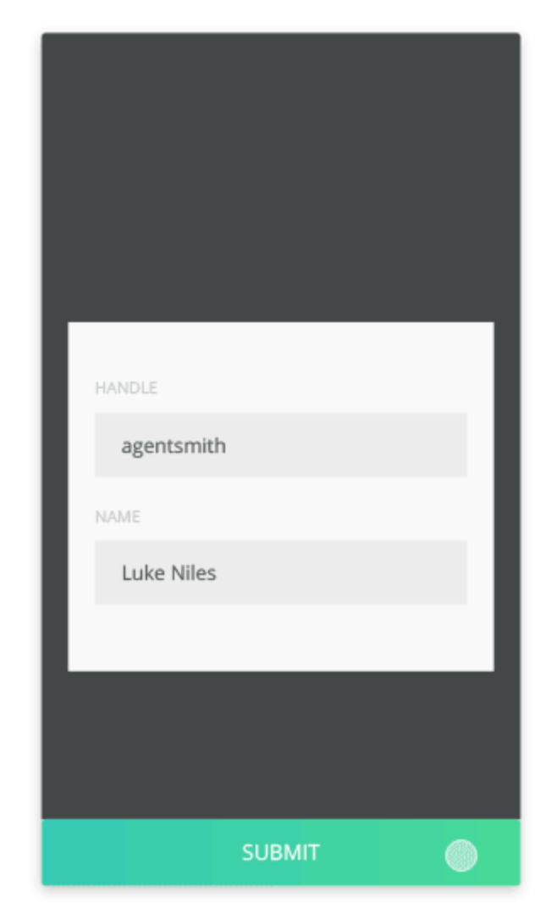
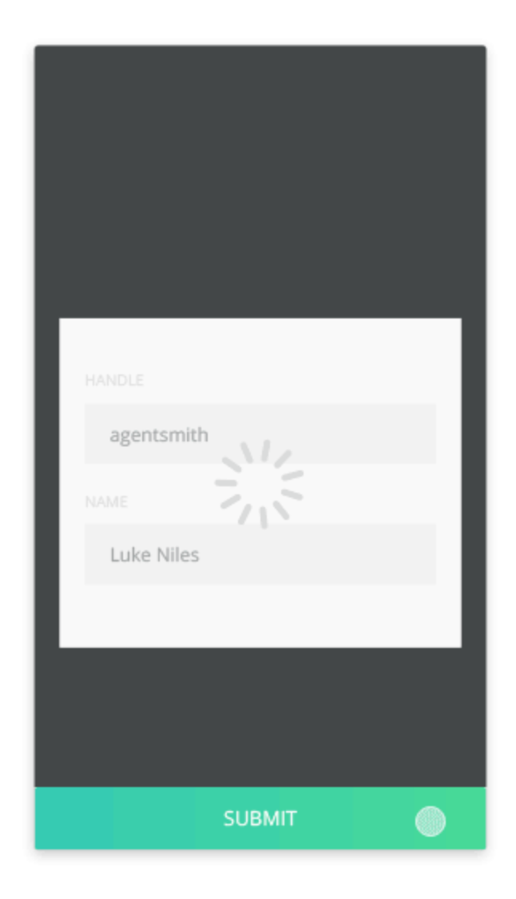
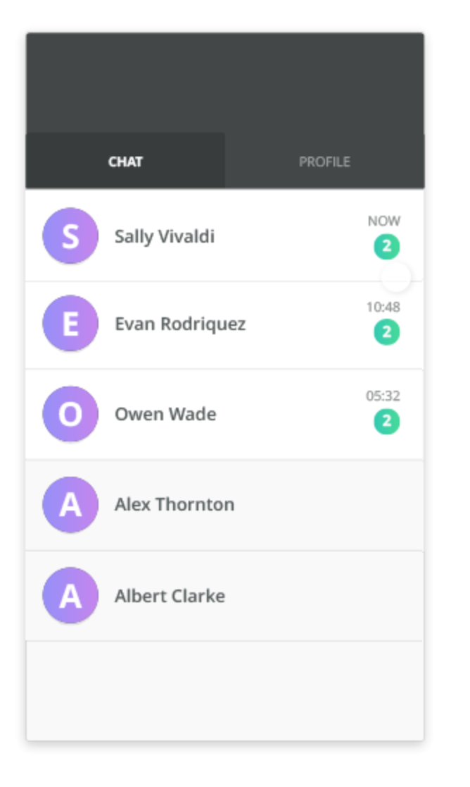
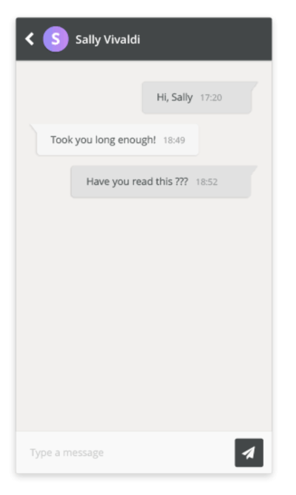

# Esercizio: client web di messaggistica minimale

Il client dovrà essere una Single Page Application, potrà essere sviluppata scegliendo tra i framework Angular 1.x/2 e React.

Il passaggio da una schermata all'altra dovrà essere gestito da un router html5 (no hashbang), dovrà permettere l'accesso alla rotta anche ricaricando completamente la pagina.

Il frame che la contiene dovrà avere un viewport simil mobile, centrato verticalmente e orizzontalmente nella pagina che lo ospita.

Non dovranno essere utilizzate librerie di stile (no bootstrap e derivati), eccezion fatta per un eventuale grid system.

Potranno essere utilizzati preprocessori css (less, sass) descrivendo le regole usando il pattern ITCSS e la BEM notation o inline stylesheet objects solo nel caso in cui si scelga React.

Si lascia allo sviluppatore la massima libertà nella disposizione e personalizzazione grafica degli elementi ove nessun vincolo sia stato specificato.

Il client dovrà connettersi a delle nostre API che forniranno:
- Il metodo di autenticazione, che accetterà delle credenziali predefinite.
- La lista contatti.
- Il log delle conversazioni per contatto.
- La possibilità di inviare un messaggio ad un contatto.
- La risposta automatica da parte di un contatto.
- Il conteggio totale dei messaggi di risposta ricevuti per contatto.

Andrà utilizzato git-flow come pattern di gestione del versionamento.

L'applicazione verrà pubblicata automaticamente generando un tag git con nome conforme all'espressione `/[0-9]+\.[0-9]+\.[0-9]+/d` e pushandolo sul remote origin.

## Struttura

```
.
├── Autenticazione
|   ├── Username
|   ├── Password
|   └── Tasto submit
├── Dashboard
|   ├── Header
|   |   └── Logo centrato
|   └── Tabs
|       ├── Lista contatti
|       |   ├── Avatar contatto
|       |   ├── Nome contatto
|       |   └── Numero di notifiche contatto
|       └── Profilo utente
|           ├── Immagine profilo
|           ├── Nickname
|           ├── Nome e cognome
|           └── Indirizzo email
└── Dettaglio contatto
    ├── Navbar
    |   ├── Tasto per tornare alla dashboard a sx
    |   └── Nome destinatario
    ├── Lista messaggi
    ├── Input invio messaggio
    └── Tasto invio messaggio
```

# Wireframes







## Note

Dovrà essere possibile fare il submit delle credenziali anche premendo il tasto invio.

L'autenticazione restituirà nella risposta un cookie di sessione che andrà passato in tutte le richieste successive per identificare la sessione.
