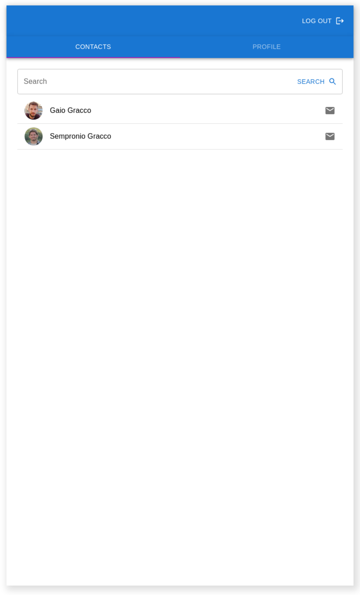
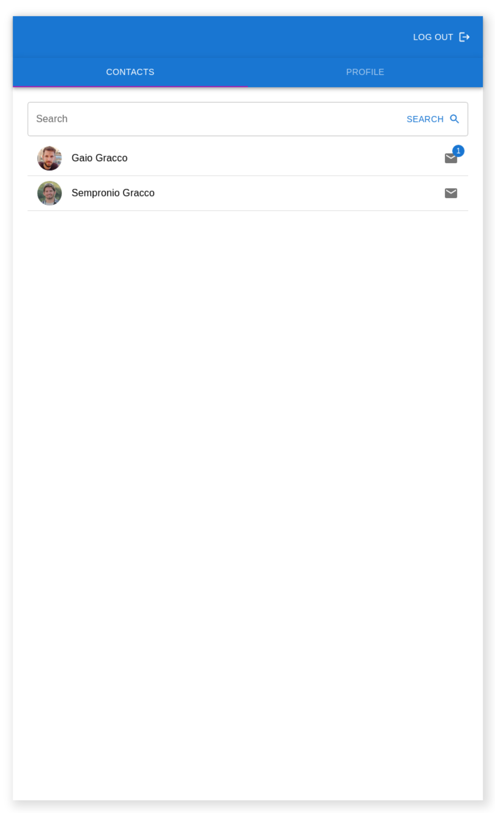

# Esercizio: client web di messaggistica minimale

Per il controllo di revisione andrà utilizzato git e un pattern a scelta tra git-flow o github-flow (pull requests).

Si lascia allo sviluppatore la massima libertà nella disposizione e personalizzazione grafica dei componenti nel caso in cui nessun vincolo sia stato specificato.

## Requisiti funzionali

L'app dovrà essere una Single Page Application.

Il passaggio da una schermata all'altra dovrà essere gestito da un router html5 (no hashbang).

E' permesso l'uso di librerie esterne per decorare i componenti (es: nella soluzione prodotta per creare i [wireframes](#wireframes) è stata usata [Material UI](https://mui.com/)).
Tutto quello che non è possibile decorare con le librerie andrà fatto a mano.

L'app dovrà collegarsi a [queste API](https://chat-server-challenge.herokuapp.com/) seguendo le specifiche descritte nella [homepage](https://chat-server-challenge.herokuapp.com/) del servizio e nel [README](https://github.com/bemindinteractive/chat-server-challenge/blob/main/README.md#chat-server-challenge) del repository.

Dovrà essere possibile fare il submit delle credenziali, della query di ricerca contatti e dei messaggi anche premendo il tasto invio oltre che premendo il bottone.

Nella viste "Lista Contatti" e "Dettaglio Contatto" andrà impostata una politica di aggiornamento del contatore dei messaggi e dei messaggi per simulare l'ascolto in tempo reale.

### Bonus 1

E' possibile utilizzare un socket disponibile sulla stessa porta del server http delle [API](https://chat-server-challenge.herokuapp.com/) per sapere davvero in tempo reale quando sono disponibili nuovi messaggi.
La homepage del servizio non contiene informazioni riguardo il socket, i dettagli sono disponibili su [github](https://github.com/bemindinteractive/chat-server-challenge). Il socket non fornirà i messaggi ma emetterà un evento che avvisa che sono disponibili nuovi messaggi, per ottenerli andrà comunque lanciato un fetch sulle [API](https://chat-server-challenge.herokuapp.com/) REST.

### Bonus 2

Gestione centralizzata dello stato dell'applicazione utilizzando [Redux](https://redux.js.org/).

### Bonus 3 (se si sceglie di usare Redux)

Persistenza dello store di redux su local storage o session storage, totale o parziale (perlomeno i dati restituiti dal servizio di autenticazione, per evitare di tornare alla vista di autenticazione ad ogni refresh della pagina).

Il progetto potrà essere inizializzato a piacere o tramite uno scaffolder. Dopo l'inizializzazione, comunicare l'URL del repository al revisore.

## Struttura Layout

Il frame che conterrà l'app dovrà avere un viewport simil-mobile, centrato verticalmente e orizzontalmente nella pagina che lo ospita.

```
.
├── Autenticazione
|   ├── Username
|   ├── Password
|   └── Tasto submit
├── Dashboard
|   ├── Header
|   |   └── Logo centrato
|   └── Tabs
|       ├── Lista contatti
|       |   ├── Avatar contatto
|       |   ├── Nome contatto
|       |   └── Numero di notifiche contatto
|       └── Profilo utente
|           ├── Immagine profilo
|           ├── Nickname
|           ├── Nome e cognome
|           └── Indirizzo email
└── Dettaglio contatto
    ├── Navbar
    |   ├── Tasto per tornare alla dashboard a sx
    |   └── Nome destinatario
    ├── Lista messaggi
    ├── Input invio messaggio
    └── Tasto invio messaggio
```

<a name="wireframes">
</a>

## Wireframes






